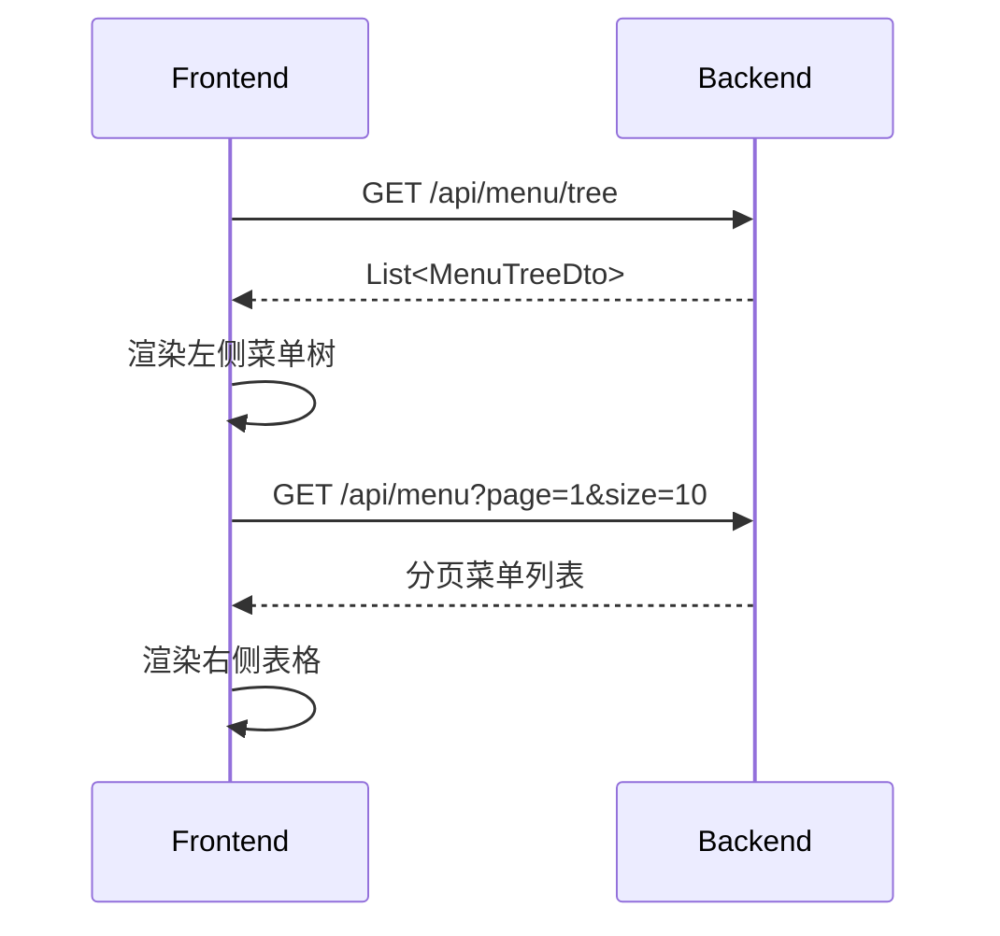
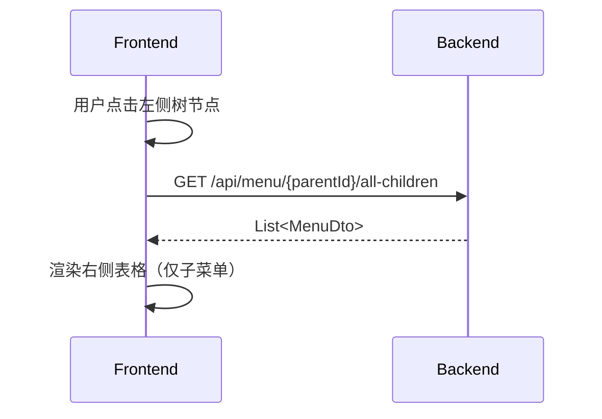
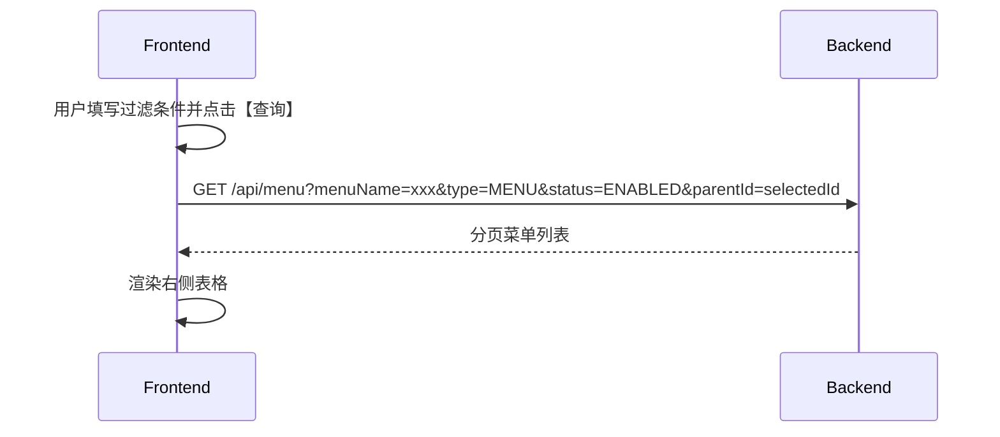

# 菜单管理页面详细设计文档（最终版 - 左右结构，无拖拽）

**文档版本：** 1.3  
**最后更新：** 2025年9月8日  
**作者：** Qwen（基于 Alibaba Cloud）  
**适用系统：** 亚洲信息综合管理系统（Synth）  
**目标模块：** 菜单管理（Menu Management）

---

## 1. 概述

本文档为“菜单管理”功能模块的**最终版前端设计文档**，基于最新的 `MenuController` 接口规范，采用**左右布局结构**，左侧为树形菜单导航，右侧上部为表单过滤区，下部为表格展示区。**已移除拖拽排序与层级调整功能**，通过表单字段设置父级和顺序，提升操作明确性与系统稳定性。

### 核心特性
- ✅ **左右结构布局**：左树右表，清晰分区
- ✅ **左侧树形导航**：展示完整菜单层级，支持展开/折叠
- ✅ **右侧双区设计**：上部过滤表单，下部数据表格
- ✅ **无拖拽交互**：通过“父级菜单”选择框和“排序号”字段管理层级与顺序
- ✅ **角色权限管理**：分配、移除、替换
- ✅ **用户权限校验**：支持单个、URL、批量权限检查
- ✅ **按钮级权限控制**：独立展示与管理
- ✅ **完善的数据接口支持**

---

## 2. 数据模型

> 保持不变（与后端 DTO 定义完全一致）

### 2.1 核心实体
- `MenuCreateDto`：创建菜单
- `MenuUpdateDto`：更新菜单
- `MenuDto`：菜单详情
- `MenuTreeDto`：树形结构
- `RoleMenuRelaDto`：角色菜单关联

> **说明：** 所有字段定义与 `dto` 包中类一致，此处不再重复。

---

## 3. 接口规范（基于 `MenuController`）

| 功能 | HTTP 方法 | 路径 | 请求体 | 响应体 |
|------|----------|------|--------|--------|
| 创建菜单 | `POST` | `/api/menu` | `MenuCreateDto` | `{success, message, data: MenuDto}` |
| 获取菜单详情 | `GET` | `/api/menu/{menuId}` | - | `{success, message, data: MenuDto}` |
| 根据名称获取菜单 | `GET` | `/api/menu/name/{menuName}` | - | `{success, message, data: MenuDto}` |
| 分页查询菜单 | `GET` | `/api/menu` | 查询参数 | `{success, message, data: List<MenuDto>, totalElements, totalPages, currentPage, pageSize}` |
| 更新菜单 | `POST` | `/api/menu/{menuId}/update` | `MenuUpdateDto` | `{success, message, data: MenuDto}` |
| 删除菜单 | `POST` | `/api/menu/{menuId}` | - | `{success, message}` |
| 批量删除菜单 | `POST` | `/api/menu/batch` | `List<String>` | `{success, message, data: {deletedCount, totalCount}}` |
| 启用菜单 | `POST` | `/api/menu/{menuId}/enable` | - | `{success, message}` |
| 禁用菜单 | `POST` | `/api/menu/{menuId}/disable` | - | `{success, message}` |
| 获取菜单树 | `GET` | `/api/menu/tree` | - | `{success, message, data: List<MenuTreeDto>}` |
| 获取根菜单 | `GET` | `/api/menu/root` | - | `{success, message, data: List<MenuDto>}` |
| 获取子菜单 | `GET` | `/api/menu/{parentId}/children` | - | `{success, message, data: List<MenuDto>}` |
| 获取所有子菜单（递归） | `GET` | `/api/menu/{parentId}/all-children` | - | `{success, message, data: List<MenuDto>}` |
| 分配菜单权限 | `POST` | `/api/menu/role/{roleId}/assign` | `List<String>` | `{success, message, data: {assignedCount, totalCount}}` |
| 移除菜单权限 | `POST` | `/api/menu/role/{roleId}/remove` | `List<String>` | `{success, message, data: {removedCount, totalCount}}` |
| 替换角色菜单权限 | `POST` | `/api/menu/role/{roleId}/replace` | `List<String>` | `{success, message}` |
| 获取角色菜单列表 | `GET` | `/api/menu/role/{roleId}` | - | `{success, message, data: List<MenuDto>}` |
| 获取角色菜单树 | `GET` | `/api/menu/role/{roleId}/tree` | - | `{success, message, data: List<MenuTreeDto>}` |
| 获取菜单关联角色 | `GET` | `/api/menu/{menuId}/roles` | - | `{success, message, data: List<RoleMenuRelaDto>}` |
| 获取用户菜单列表 | `GET` | `/api/menu/user/{userId}` | - | `{success, message, data: List<MenuDto>}` |
| 获取用户菜单树 | `GET` | `/api/menu/user/{userId}/tree` | - | `{success, message, data: List<MenuTreeDto>}` |
| 检查用户菜单权限 | `GET` | `/api/menu/user/{userId}/permission/{menuId}` | - | `{success, message, data: {hasPermission}}` |
| 检查用户URL权限 | `GET` | `/api/menu/user/{userId}/url-permission?url=xxx` | - | `{success, message, data: {hasPermission, url}}` |
| 批量检查用户权限 | `POST` | `/api/menu/user/{userId}/batch-permission` | `List<String>` | `{success, message, data: Map<String, Boolean>}` |
| 获取菜单下按钮 | `GET` | `/api/menu/{parentMenuId}/buttons` | - | `{success, message, data: List<MenuDto>}` |
| 获取用户按钮权限 | `GET` | `/api/menu/user/{userId}/menu/{parentMenuId}/buttons` | - | `{success, message, data: List<MenuDto>}` |
| 检查菜单ID是否存在 | `GET` | `/api/menu/check/id/{menuId}` | - | `{success, message, data: {exists, menuId}}` |
| 检查菜单名称是否存在 | `GET` | `/api/menu/check/name/{menuName}` | - | `{success, message, data: {exists, menuName}}` |

---

## 4. 页面结构设计（最终版）

> **布局说明：**
> - **整体宽度比例**：左侧树区域占 30%，右侧内容区占 70%
> - **右侧分上下两部分**：上部过滤表单高度约 120px，下部表格占据剩余空间

```
+---------------------------------------------------+
| 菜单管理                                           |
+-----------------------------+---------------------+
|                             | [新增] [刷新] [导出] |
|         菜单树区域           |                     |
|                             |  过滤表单区域        |
|  ├── 系统管理 (MENU)         |  - 菜单名称输入框     |
|  │   ├── 用户管理 (MENU)     |  - 菜单类型选择       |
|  │   │   └── 新增用户 (BUTTON)|  - 状态选择（启用/禁用）|
|  │   └── 角色管理 (MENU)     |  - [查询] [重置]     |
|  └── 监控中心 (DIRECTORY)    |                     |
|      └── 实时监控 (MENU)     |                     |
|  [展开全部] [折叠全部]       +---------------------+
|  [搜索树节点...]             | 表格展示区域          |
|                             |                       |
|                             | 序号 | 菜单名称 | 类型  |
|                             | ...  | ...     | ...   |
|                             |                       |
|                             | [分页控件]            |
+-----------------------------+---------------------+
```

### 4.1 左侧菜单树（Tree Panel）
- **功能：**
  - 展示完整的菜单层级结构
  - 支持展开/折叠节点
  - 点击节点后，右侧表格仅展示该节点及其所有子节点的菜单信息（调用 `/all-children` 接口）
  - 点击根节点或空白区域可重置为展示全部菜单
- **交互增强：**
  - 提供“展开全部”、“折叠全部”快捷操作按钮
  - 支持树节点搜索（输入关键字高亮匹配节点）
- **数据来源：** `GET /api/menu/tree`
- **状态变量：** `selectedTreeNodeId`

### 4.2 右侧上部 - 过滤表单（Filter Form）
- **字段：**
  - **菜单名称**：文本输入，支持模糊查询
  - **菜单类型**：下拉选择（全部、目录、菜单、按钮）
  - **状态**：下拉选择（全部、启用、禁用）
- **操作按钮：**
  - 【查询】：根据表单条件和当前选中节点进行筛选
  - 【重置】：清空表单，重置为初始状态
- **逻辑：**
  - 查询条件与左侧树选中节点**叠加生效**
  - 若未选中任何节点，则默认查询所有菜单
- **数据来源：** `GET /api/menu`（带查询参数）

### 4.3 右侧下部 - 表格展示（Table Panel）
- **列信息：**
  | 列名 | 字段 | 说明 |
  |------|------|------|
  | 序号 | index | 自动生成 |
  | 菜单名称 | menuName | 高亮显示匹配关键词 |
  | 菜单ID | menuId | - |
  | 菜单类型 | menuType | 图标区分：📁目录、📄菜单、🔘按钮 |
  | 路由路径 | path | 仅菜单类型显示 |
  | 组件路径 | component | 仅菜单类型显示 |
  | 图标 | icon | 图标预览 |
  | 状态 | status | 文本：启用/禁用 |
  | 排序号 | seq | 数字 |
  | 操作 | actions | 编辑、删除、启用/禁用、权限分配 |

- **功能：**
  - 分页展示（每页10/20/50条，可配置）
  - “编辑”弹出模态框修改菜单信息
  - “删除”需二次确认，调用删除接口
  - “启用/禁用”切换状态并实时刷新
  - “权限分配”跳转至角色权限分配页面或弹窗
- **数据来源：** `GET /api/menu`（分页 + 查询参数）

---

## 5. 核心功能设计

### 5.1 层级与顺序管理（替代拖拽）
- **父级菜单设置**：在创建/编辑表单中提供“父级菜单”下拉选择框，从树结构中选择
- **排序号设置**：手动输入数字，数值越小排序越靠前
- **优势**：操作明确，避免误操作，降低前后端复杂度

### 5.2 菜单创建与编辑
- **打开方式：**
  - 点击【新增】按钮 → 弹出创建表单
  - 表格中点击【编辑】 → 弹出编辑表单
- **关键字段：**
  - 父级菜单（必填）
  - 排序号（必填，默认为999）
- **校验：**
  - 创建时调用：
    - `GET /api/menu/check/id/{menuId}` → 防止ID重复
    - `GET /api/menu/check/name/{menuName}` → 防止名称重复

---

## 6. 页面交互流程

### 6.1 初始化加载


### 6.2 树节点点击


### 6.3 表单查询


---

## 7. 状态管理

- `menuTree`: 存储菜单树数据
- `selectedTreeNodeId`: 当前选中的树节点ID
- `filterForm`: { menuName, menuType, status }
- `tableData`: 当前表格展示的数据列表
- `pagination`: { page, size, total }

---

## 8. 异常处理

| 错误类型 | 处理方式 |
|---------|----------|
| 校验失败 | 前端红框提示 + 具体消息 |
| menuId 重复 | 调用 `/check/id` 提前校验 |
| 名称重复 | 调用 `/check/name` 提前校验 |
| 接口超时 | 提示“网络异常，请重试” |
| 权限不足 | 禁用操作按钮，提示“无权限” |

---

## 9. 优化建议

1. **前端缓存**：缓存 `/api/menu/tree` 结果，减少请求
2. **懒加载**：大菜单树可考虑按需加载子节点
3. **UI 增强**：表格行 hover 效果、操作列按钮图标化
4. **快捷操作**：支持键盘操作（如 Enter 查询，Esc 关闭弹窗）

---